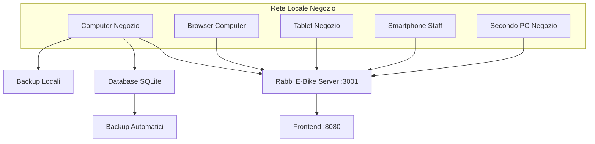

# 🏪 Installazione per Uso Locale Permanente

## 📚 Indice
- [Panoramica Uso Locale](#-panoramica-uso-locale)
- [Setup Computer Negozio](#-setup-computer-negozio)
- [Configurazione Rete Locale](#-configurazione-rete-locale)
- [Avvio Automatico](#-avvio-automatico)
- [Backup e Sicurezza](#-backup-e-sicurezza)
- [Accesso Multi-Dispositivo](#-accesso-multi-dispositivo)
- [Manutenzione Ordinaria](#-manutenzione-ordinaria)

---

## 🎯 Panoramica Uso Locale

Rabbi E-Bike è pensato per funzionare **permanentemente** sul computer del tuo negozio di noleggio biciclette, fornendo:

### **✅ Vantaggi dell'Uso Locale:**
- **🏪 Controllo Totale:** Dati sempre sul tuo computer, nessuna dipendenza da servizi esterni
- **⚡ Velocità:** Interfaccia reattiva, database locale SQLite super-veloce  
- **🔒 Privacy:** Zero dati condivisi online, GDPR-compliant by design
- **💰 Costo Zero:** Nessun abbonamento, canone, o costi cloud
- **🌐 Funziona Offline:** Internet serve solo per aggiornamenti, non per l'uso quotidiano
- **📱 Multi-Dispositivo:** Accessibile da PC, tablet, smartphone nella rete del negozio

### **🏗️ Architettura Locale:**


---

## 💻 Setup Computer Negozio

### **Requisiti Computer Negozio:**

#### **Specifiche Minime (Negozio Piccolo):**
- **CPU:** Qualsiasi processore del 2015+
- **RAM:** 4GB (8GB raccomandati) 
- **Storage:** 10GB liberi per applicazione + dati
- **OS:** Windows 10+, macOS 10.14+, o Ubuntu 18.04+
- **Rete:** WiFi/Ethernet per connessione dispositivi locali

#### **Specifiche Consigliate (Negozio Medio/Grande):**
- **CPU:** Intel i5 / AMD Ryzen 5 o superiore
- **RAM:** 8GB+ 
- **Storage:** SSD da 250GB+ (per backup multipli)
- **OS:** Windows 11 Pro, macOS latest, Ubuntu LTS
- **Rete:** Ethernet gigabit + WiFi dual-band

### **Installazione Base Permanente:**

#### **Windows (Più comune nei negozi):**
```batch
REM Download e installa come amministratore
REM 1. Node.js LTS da https://nodejs.org/
REM 2. Git per Windows da https://git-scm.com/

REM Installa Rabbi E-Bike in cartella permanente
mkdir C:\RabbiEBike
cd C:\RabbiEBike
git clone https://github.com/simo-hue/rabbi-ebike-management-system.git .

REM Setup permanente
npm install --production
cd server && npm install --production && cd ..
npm run build

REM Installa PM2 per gestione permanente
npm install -g pm2
```

#### **macOS (Apple Computer):**
```bash
# Installa Homebrew se non presente
/bin/bash -c "$(curl -fsSL https://raw.githubusercontent.com/Homebrew/install/HEAD/install.sh)"

# Installa prerequisiti
brew install node git

# Setup Rabbi E-Bike in posizione permanente
sudo mkdir -p /Applications/RabbiEBike
sudo chown $(whoami) /Applications/RabbiEBike
cd /Applications/RabbiEBike
git clone https://github.com/simo-hue/rabbi-ebike-management-system.git .

# Setup e build
npm install --production
cd server && npm install --production && cd ..
npm run build
npm install -g pm2
```

---

## 🌐 Configurazione Rete Locale

### **Setup Accesso Multi-Dispositivo:**

#### **1. Trova IP del Computer Negozio:**

**Windows:**
```cmd
ipconfig | findstr "IPv4"
REM Esempio output: 192.168.1.100
```

**macOS/Linux:**
```bash
ifconfig | grep "inet " | grep -v 127.0.0.1
# Esempio output: inet 192.168.1.100
```

#### **2. Configura Vite per Accesso Rete:**

Modifica `vite.config.ts`:
```typescript
// vite.config.ts
export default defineConfig({
  server: {
    port: 8080,
    host: '0.0.0.0',  // Permette accesso da altri dispositivi
    strictPort: true
  },
  // ... resto configurazione
})
```

#### **3. Configura Express Server per Rete:**

Modifica `server/server.js`:
```javascript
// Bind a tutti gli indirizzi di rete
app.listen(PORT, '0.0.0.0', () => {
  console.log(`🚀 Rabbi E-Bike Server running on:`)
  console.log(`   Local: http://localhost:${PORT}`)
  console.log(`   Network: http://[YOUR-IP]:${PORT}`)
})
```

#### **4. Test Accesso da Altri Dispositivi:**

Da tablet/smartphone nella stessa rete WiFi:
- **Frontend:** `http://192.168.1.100:8080`
- **API diretta:** `http://192.168.1.100:3001/api/health`

### **Configurazione Firewall:**

#### **Windows Firewall:**
```cmd
REM Permetti Node.js attraverso firewall
netsh advfirewall firewall add rule name="Rabbi E-Bike Server" dir=in action=allow protocol=TCP localport=3001
netsh advfirewall firewall add rule name="Rabbi E-Bike Frontend" dir=in action=allow protocol=TCP localport=8080
```

#### **macOS Firewall:**
```bash
# Via interfaccia grafica:
# Sistema → Sicurezza → Firewall → Opzioni Firewall
# Aggiungi "node" alle applicazioni consentite
```

---

## 🚀 Avvio Automatico

### **PM2 Setup per Avvio Permanente:**

#### **Configurazione PM2:**
```javascript
// ecosystem.config.js
module.exports = {
  apps: [{
    name: 'rabbi-ebike-server',
    script: 'server.js',
    cwd: './server',
    instances: 1,
    autorestart: true,
    watch: false,
    max_memory_restart: '500M',
    env: {
      NODE_ENV: 'production',
      PORT: 3001
    },
    // Restart automatico in caso di crash
    min_uptime: '10s',
    max_restarts: 10,
    // Log rotation per non riempire disco
    error_file: './logs/err.log',
    out_file: './logs/out.log',
    log_file: './logs/combined.log',
    time: true
  }, {
    name: 'rabbi-ebike-frontend',
    script: 'npm',
    args: 'run preview',  // Usa build di produzione, non dev
    instances: 1,
    autorestart: true,
    watch: false,
    max_memory_restart: '200M'
  }]
}
```

#### **Avvio con Sistema Operativo:**

**Windows (Startup + PM2):**
```batch
REM Installa servizio Windows per PM2
npm install -g pm2-windows-startup
pm2-startup install

REM Avvia applicazioni
cd C:\RabbiEBike
pm2 start ecosystem.config.js
pm2 save

REM Ora PM2 si avvia automaticamente con Windows
```

**macOS (LaunchAgent):**
```bash
# Setup PM2 startup
pm2 startup
# Esegui il comando che PM2 suggerisce (con sudo)

# Start apps e salva configurazione
pm2 start ecosystem.config.js
pm2 save

# Testa riavvio
pm2 resurrect
```

### **Script di Avvio Semplificato:**

#### **Avvio One-Click (Windows):**
```batch
REM start-rabbi-ebike.bat
@echo off
title Rabbi E-Bike - Negozio
cd /d "C:\RabbiEBike"

echo 🚴‍♂️ Avviando Rabbi E-Bike Management System...
echo.

REM Verifica che PM2 sia installato
pm2 --version >nul 2>&1
if %errorlevel% neq 0 (
    echo Installing PM2...
    npm install -g pm2
)

REM Avvia con PM2 se non già attivo
pm2 describe rabbi-ebike-server >nul 2>&1
if %errorlevel% neq 0 (
    echo Starting Rabbi E-Bike servers...
    pm2 start ecosystem.config.js
) else (
    echo Rabbi E-Bike already running, restarting...
    pm2 restart all
)

REM Apri browser dopo 5 secondi
timeout /t 5 >nul
start http://localhost:8080

echo.
echo ✅ Rabbi E-Bike pronto all'uso!
echo 🌍 Browser: http://localhost:8080
echo 📱 Da tablet/phone: http://[IP-TUO-COMPUTER]:8080
echo.
pause
```

#### **Stop Sicuro (Windows):**
```batch
REM stop-rabbi-ebike.bat
@echo off
title Rabbi E-Bike - Stop
echo 🛑 Fermando Rabbi E-Bike Management System...

pm2 stop all
echo ✅ Sistema fermato correttamente!
echo.
echo I dati sono salvati automaticamente.
pause
```

---

## 💾 Backup e Sicurezza Locale

### **Strategia Backup per Negozi:**

#### **Backup Automatico Giornaliero:**
```bash
#!/bin/bash
# daily-backup.sh (Linux/macOS) o daily-backup.bat (Windows)

BACKUP_DIR="./backups"
DATE=$(date +%Y%m%d_%H%M%S)
DB_FILE="./server/rabbi_ebike.db"

# Crea backup compresso
mkdir -p $BACKUP_DIR
sqlite3 $DB_FILE ".backup $BACKUP_DIR/rabbi_backup_$DATE.db"
tar -czf "$BACKUP_DIR/full_backup_$DATE.tar.gz" server/rabbi_ebike.db server/backups

# Mantieni solo ultimi 30 giorni
find $BACKUP_DIR -name "rabbi_backup_*.db" -mtime +30 -delete
find $BACKUP_DIR -name "full_backup_*.tar.gz" -mtime +30 -delete

echo "✅ Backup completato: $BACKUP_DIR/rabbi_backup_$DATE.db"
```

#### **Backup su Chiavetta USB (Consigliato):**
```batch
REM backup-usb.bat - Windows
@echo off
set USB_DRIVE=E:
set DATE=%DATE:~6,4%%DATE:~3,2%%DATE:~0,2%

if exist %USB_DRIVE%\ (
    echo 💾 Backup su chiavetta USB %USB_DRIVE%...
    mkdir "%USB_DRIVE%\RabbiEBike_Backups" 2>nul
    copy "server\rabbi_ebike.db" "%USB_DRIVE%\RabbiEBike_Backups\backup_%DATE%.db"
    echo ✅ Backup completato su chiavetta!
) else (
    echo ❌ Chiavetta USB non trovata su %USB_DRIVE%
)
pause
```

### **Sicurezza Locale:**

#### **Protezione File Database:**
```bash
# Solo proprietario può leggere/scrivere database
chmod 600 server/rabbi_ebike.db

# Cartella backup protetta
chmod 700 server/backups/
```

#### **Password Protezione (Opzionale):**
```javascript
// server/auth-middleware.js (da aggiungere se necessario)
const basicAuth = require('basic-auth-connect');

// Solo se vuoi proteggere l'accesso con password
app.use('/admin', basicAuth('admin', 'password-del-negozio'));
```

---

## 📱 Accesso Multi-Dispositivo

### **Setup Dispositivi Negozio:**

#### **Computer Principale (Manager):**
- **URL:** `http://localhost:8080`
- **Funzioni:** Tutte le funzionalità complete
- **Uso:** Configurazione, statistiche, gestione completa

#### **Tablet/iPad (Reception):**
- **URL:** `http://[IP-COMPUTER]:8080` 
- **Funzioni:** Prenotazioni, calendario, check-in clienti
- **Uso:** Front-desk, accoglienza clienti

#### **Smartphone Staff:**
- **URL:** `http://[IP-COMPUTER]:8080`
- **Funzioni:** Controllo veloce disponibilità, prenotazioni urgenti
- **Uso:** Staff in movimento, controlli rapidi

### **Ottimizzazione Mobile:**

L'interfaccia è già responsive, ma per uso intensivo su tablet:

```javascript
// Nel browser del tablet, aggiungi alla homescreen:
// Chrome Android: Menu → "Aggiungi alla schermata Home"
// Safari iOS: Condividi → "Aggiungi alla schermata Home"

// Risultato: icona app nativa che apre direttamente Rabbi E-Bike
```

---

## 🔧 Manutenzione Ordinaria

### **Routine Settimanale (5 minuti):**

#### **Controlli Salute Sistema:**
```bash
# health-check.sh
#!/bin/bash
echo "🔍 Controllo salute Rabbi E-Bike..."

# Test connessione API
if curl -f http://localhost:3001/api/health >/dev/null 2>&1; then
    echo "✅ Server API: OK"
else
    echo "❌ Server API: PROBLEMA"
    pm2 restart rabbi-ebike-server
fi

# Controllo spazio disco
DISK_USAGE=$(df -h . | awk 'NR==2 {print $5}' | sed 's/%//')
if [ $DISK_USAGE -gt 80 ]; then
    echo "⚠️  Spazio disco: ${DISK_USAGE}% (pulizia consigliata)"
else
    echo "✅ Spazio disco: ${DISK_USAGE}% OK"
fi

# Dimensione database
DB_SIZE=$(du -h server/rabbi_ebike.db | cut -f1)
echo "📊 Database: ${DB_SIZE}"

# Numero backup
BACKUP_COUNT=$(ls server/backups/*.db 2>/dev/null | wc -l)
echo "💾 Backup disponibili: ${BACKUP_COUNT}"

echo "✅ Controllo completato!"
```

### **Routine Mensile (15 minuti):**

#### **Ottimizzazione Database:**
```bash
# optimize-db.sh
#!/bin/bash
echo "🗃️ Ottimizzazione database..."

# Backup pre-ottimizzazione
sqlite3 server/rabbi_ebike.db ".backup server/backups/pre_optimize_$(date +%Y%m%d).db"

# Ottimizzazione
sqlite3 server/rabbi_ebike.db "VACUUM; ANALYZE;"

echo "✅ Database ottimizzato!"

# Statistiche
echo "📊 Statistiche database:"
sqlite3 server/rabbi_ebike.db "
SELECT 
  'Prenotazioni totali: ' || COUNT(*) FROM bookings
UNION ALL SELECT 
  'Biciclette: ' || COUNT(*) FROM bikes
UNION ALL SELECT
  'Backup automatici: ' || COUNT(*) FROM (SELECT name FROM sqlite_master WHERE type='table')
"
```

### **Updates Sistema:**

#### **Aggiornamento Rabbi E-Bike:**
```bash
# update-rabbi-ebike.sh
#!/bin/bash
echo "🔄 Aggiornamento Rabbi E-Bike..."

# Backup completo pre-aggiornamento
./daily-backup.sh

# Ferma servizi
pm2 stop all

# Aggiorna codice
git pull origin main

# Aggiorna dipendenze se necessario
npm install --production
cd server && npm install --production && cd ..

# Rebuild frontend
npm run build

# Riavvia servizi
pm2 start ecosystem.config.js

# Test
sleep 10
if curl -f http://localhost:3001/api/health >/dev/null 2>&1; then
    echo "✅ Aggiornamento riuscito!"
else
    echo "❌ Problemi nell'aggiornamento, ripristino backup..."
    # Logica di rollback se necessario
fi
```

---

## 📋 Checklist Setup Completo

### ✅ **Installazione Base:**
- [ ] Node.js installato e funzionante
- [ ] Git installato (per aggiornamenti)
- [ ] Rabbi E-Bike clonato in posizione permanente
- [ ] Dipendenze installate (frontend e backend)
- [ ] Build produzione completata (`npm run build`)
- [ ] Test localhost funzionante

### ✅ **Configurazione Permanente:**
- [ ] PM2 installato globalmente
- [ ] Ecosystem config creato e testato
- [ ] PM2 startup configurato (avvio automatico)
- [ ] Firewall configurato per rete locale
- [ ] Accesso da dispositivi locali testato

### ✅ **Backup e Sicurezza:**
- [ ] Script backup automatico configurato
- [ ] Backup su supporto esterno (USB) configurato
- [ ] Permissions file database impostate
- [ ] Test restore da backup eseguito

### ✅ **Utilizzo Quotidiano:**
- [ ] Accesso rapido configurato (icone desktop/homescreen)
- [ ] Staff formato sull'uso base
- [ ] Procedura backup settimanale stabilita
- [ ] Contatti per supporto tecnico annotati

---

**🎉 Il tuo negozio ha ora un sistema gestionale permanente, affidabile e completamente locale!**

**Per supporto installazione locale:** Apri issue GitHub con tag `local-setup` e descrivi la configurazione del tuo negozio.

**Made with ❤️ by Simone Mattioli** | Rabbi E-Bike Management System v1.0.0