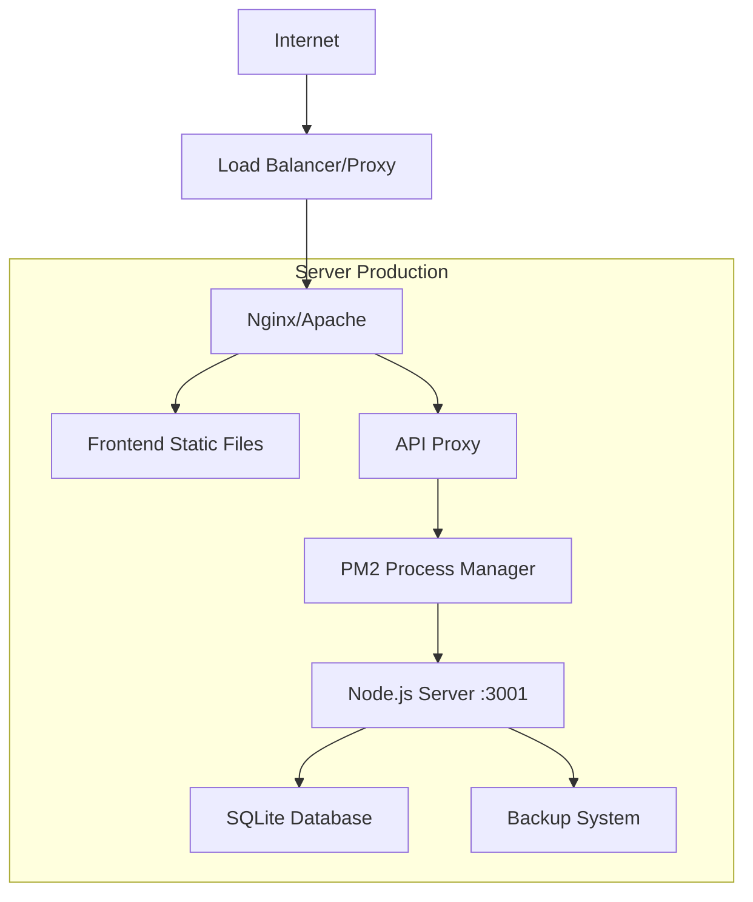

# 🏭 Guida Deployment in Produzione

## 📚 Indice
- [Panoramica Deployment](#-panoramica-deployment)
- [Prerequisiti Server](#-prerequisiti-server)
- [Opzione 1: VPS/Server Dedicato](#-opzione-1-vpsserver-dedicato)
- [Opzione 2: Cloud Deployment](#-opzione-2-cloud-deployment)
- [Opzione 3: Docker Deployment](#-opzione-3-docker-deployment)
- [Configurazione SSL/HTTPS](#-configurazione-sslhttps)
- [Backup e Monitoraggio](#-backup-e-monitoraggio)
- [Sicurezza](#-sicurezza)
- [Maintenance e Updates](#-maintenance-e-updates)

---

## 🎯 Panoramica Deployment

Rabbi E-Bike può essere deployato in diversi ambienti di produzione, dalle soluzioni più semplici (VPS singolo) a configurazioni enterprise (Docker + load balancer).

### **🏗️ Architettura Produzione Tipica:**



### **📋 Scelte Deployment:**

| Opzione | Complessità | Costo | Scalabilità | Consigliato per |
|---------|-------------|-------|-------------|-----------------|
| VPS Singolo | ⭐⭐ | €10-50/mese | Limitata | Piccole attività |
| Cloud (AWS/GCP) | ⭐⭐⭐ | €20-100/mese | Alta | Medie attività |
| Docker + K8s | ⭐⭐⭐⭐⭐ | €50-200/mese | Molto Alta | Aziende grandi |

---

## 🔧 Prerequisiti Server

### **Specifiche Minime Server:**
- **CPU:** 1 vCPU (2 vCPU raccomandato)
- **RAM:** 1GB (2GB raccomandato)  
- **Storage:** 20GB SSD (50GB raccomandato)
- **Network:** 100Mbps
- **OS:** Ubuntu 20.04+ / CentOS 8+ / Debian 11+

### **Software Requirements:**
- **Node.js** >= 16.0.0
- **npm** >= 7.0.0
- **PM2** (process manager)
- **Nginx** (web server/proxy)
- **Certbot** (SSL certificates)
- **Git** (per updates)

---

## 🌐 Opzione 1: VPS/Server Dedicato

Perfetto per piccole/medie attività. Una singola macchina che serve tutto.

### **1A. Setup Iniziale Server**

#### **Connessione e Security Basics:**
```bash
# Connetti via SSH
ssh root@your-server-ip

# Update sistema
apt update && apt upgrade -y

# Crea user non-root
adduser rabbi
usermod -aG sudo rabbi
su - rabbi

# Setup firewall base
sudo ufw allow 22    # SSH
sudo ufw allow 80    # HTTP  
sudo ufw allow 443   # HTTPS
sudo ufw enable
```

#### **Installazione Node.js:**
```bash
# Via NodeSource (raccomandato)
curl -fsSL https://deb.nodesource.com/setup_18.x | sudo -E bash -
sudo apt-get install -y nodejs

# Verifica installazione
node --version  # v18.x.x
npm --version   # 9.x.x
```

#### **Installazione PM2:**
```bash
sudo npm install -g pm2

# Setup PM2 startup
pm2 startup
# Seguire le istruzioni mostrate
```

#### **Installazione Nginx:**
```bash
sudo apt install nginx -y
sudo systemctl start nginx
sudo systemctl enable nginx

# Test
curl http://your-server-ip  # Dovrebbe mostrare pagina default nginx
```

### **1B. Deploy Applicazione**

#### **Clone e Build:**
```bash
# Clone repository
cd /home/rabbi
git clone https://github.com/simo-hue/rabbi-ebike-management-system.git rabbieebike
cd rabbieebike

# Install dependencies
npm install
cd server && npm install --production && cd ..

# Build frontend per produzione
npm run build
```

#### **Configurazione Server:**
```bash
# Crea file di configurazione produzione
cd server
cat > ecosystem.config.js << 'EOF'
module.exports = {
  apps: [{
    name: 'rabbi-ebike-server',
    script: 'server.js',
    instances: 1,
    autorestart: true,
    watch: false,
    max_memory_restart: '1G',
    env: {
      NODE_ENV: 'production',
      PORT: 3001
    }
  }]
}
EOF

# Start con PM2
pm2 start ecosystem.config.js
pm2 save
```

#### **Configurazione Nginx:**
```bash
sudo tee /etc/nginx/sites-available/rabbieebike << 'EOF'
server {
    listen 80;
    server_name your-domain.com www.your-domain.com;
    root /home/rabbi/rabbieebike/dist;
    index index.html;

    # Gzip compression
    gzip on;
    gzip_types text/plain text/css application/javascript application/json image/svg+xml;

    # Frontend static files
    location / {
        try_files $uri $uri/ /index.html;
        expires 1y;
        add_header Cache-Control "public, immutable";
    }

    # API proxy to backend
    location /api {
        proxy_pass http://localhost:3001;
        proxy_http_version 1.1;
        proxy_set_header Upgrade $http_upgrade;
        proxy_set_header Connection 'upgrade';
        proxy_set_header Host $host;
        proxy_set_header X-Real-IP $remote_addr;
        proxy_set_header X-Forwarded-For $proxy_add_x_forwarded_for;
        proxy_set_header X-Forwarded-Proto $scheme;
        proxy_cache_bypass $http_upgrade;
    }

    # Security headers
    add_header X-Content-Type-Options nosniff;
    add_header X-Frame-Options DENY;
    add_header X-XSS-Protection "1; mode=block";
}
EOF

# Attiva sito
sudo ln -s /etc/nginx/sites-available/rabbieebike /etc/nginx/sites-enabled/
sudo rm /etc/nginx/sites-enabled/default  # Rimuovi default

# Test configurazione
sudo nginx -t
sudo systemctl reload nginx
```

### **1C. Configurazione SSL/HTTPS:**

```bash
# Install Certbot
sudo apt install certbot python3-certbot-nginx -y

# Ottieni certificato SSL
sudo certbot --nginx -d your-domain.com -d www.your-domain.com

# Test auto-renewal
sudo certbot renew --dry-run

# Il certificato si rinnova automaticamente
```

### **1D. Verifica Deployment:**
```bash
# Test server backend
curl http://localhost:3001/api/health

# Test completo via nginx
curl https://your-domain.com/api/health

# Monitor logs
pm2 logs rabbi-ebike-server
tail -f /var/log/nginx/access.log
```

---

## ☁️ Opzione 2: Cloud Deployment

### **2A. AWS EC2 Deployment**

#### **Setup EC2 Instance:**
```bash
# Launch EC2 instance (Amazon Linux 2)
# t3.small (2 vCPU, 2GB RAM) raccomandato

# Connect via SSH
ssh -i your-key.pem ec2-user@your-ec2-ip

# Install Node.js su Amazon Linux
curl -o- https://raw.githubusercontent.com/nvm-sh/nvm/v0.38.0/install.sh | bash
source ~/.bashrc
nvm install 18
nvm use 18

# Install PM2 e Nginx
sudo yum update -y
sudo amazon-linux-extras install nginx1 -y
npm install -g pm2
```

#### **Deploy con AWS Systems Manager:**
```bash
# Crea script deploy automatico
cat > deploy.sh << 'EOF'
#!/bin/bash
cd /home/ec2-user
git clone https://github.com/simo-hue/rabbi-ebike-management-system.git rabbieebike
cd rabbieebike
npm install --production
cd server && npm install --production && cd ..
npm run build
pm2 start server/ecosystem.config.js
pm2 save
sudo systemctl start nginx
EOF

chmod +x deploy.sh
./deploy.sh
```

#### **Setup Load Balancer (ALB):**
```yaml
# alb-config.yaml (per Terraform/CloudFormation)
Resources:
  LoadBalancer:
    Type: AWS::ElasticLoadBalancingV2::LoadBalancer
    Properties:
      Name: rabbi-ebike-alb
      Scheme: internet-facing
      SecurityGroups: [!Ref ALBSecurityGroup]
      Subnets: [subnet-xxx, subnet-yyy]
      
  TargetGroup:
    Type: AWS::ElasticLoadBalancingV2::TargetGroup
    Properties:
      Name: rabbi-ebike-targets
      Port: 80
      Protocol: HTTP
      VpcId: vpc-xxx
      HealthCheckPath: /api/health
```

### **2B. Google Cloud Platform (GCP)**

#### **Compute Engine Setup:**
```bash
# Create VM instance
gcloud compute instances create rabbi-ebike-vm \
    --zone=europe-west1-b \
    --machine-type=e2-small \
    --boot-disk-size=20GB \
    --boot-disk-type=pd-ssd \
    --image-family=ubuntu-2004-lts \
    --image-project=ubuntu-os-cloud \
    --tags=http-server,https-server

# SSH into instance
gcloud compute ssh rabbi-ebike-vm --zone=europe-west1-b
```

#### **Cloud Build Setup (CI/CD):**
```yaml
# cloudbuild.yaml
steps:
  # Build frontend
  - name: 'node:18'
    entrypoint: 'bash'
    args:
      - '-c'
      - 'npm install && npm run build'
    
  # Deploy to Compute Engine
  - name: 'gcr.io/cloud-builders/gcloud'
    args:
      - 'compute'
      - 'scp'
      - '--recurse'
      - 'dist/'
      - 'rabbi-ebike-vm:/var/www/html/'
      - '--zone=europe-west1-b'
```

### **2C. DigitalOcean App Platform**

```yaml
# .do/app.yaml
name: rabbi-ebike-app
services:
  # Static site (frontend)
  - name: frontend
    source_dir: /
    github:
      repo: your-username/rabbi-ebike-management-system
      branch: main
    run_command: npm run build
    output_dir: dist
    routes:
      - path: /
    
  # Backend API
  - name: backend
    source_dir: /server
    github:
      repo: your-username/rabbi-ebike-management-system  
      branch: main
    run_command: npm start
    environment_slug: node-js
    instance_count: 1
    instance_size_slug: basic-xxs
    routes:
      - path: /api
    envs:
      - key: NODE_ENV
        value: production
```

---

## 🐳 Opzione 3: Docker Deployment

Scalabile, portabile, facilita CI/CD.

### **3A. Containerizzazione**

#### **Frontend Dockerfile:**
```dockerfile
# Dockerfile.frontend
FROM node:18-alpine AS builder
WORKDIR /app
COPY package*.json ./
RUN npm install --frozen-lockfile
COPY . .
RUN npm run build

FROM nginx:alpine
COPY --from=builder /app/dist /usr/share/nginx/html
COPY nginx.conf /etc/nginx/nginx.conf
EXPOSE 80
CMD ["nginx", "-g", "daemon off;"]
```

#### **Backend Dockerfile:**
```dockerfile
# server/Dockerfile
FROM node:18-alpine
WORKDIR /app
COPY package*.json ./
RUN npm install --only=production
COPY . .
RUN mkdir -p /app/backups
VOLUME ["/app/backups", "/app/rabbi_ebike.db"]
EXPOSE 3001
CMD ["npm", "start"]
```

#### **Docker Compose:**
```yaml
# docker-compose.yml
version: '3.8'
services:
  frontend:
    build:
      context: .
      dockerfile: Dockerfile.frontend
    ports:
      - "80:80"
      - "443:443"
    depends_on:
      - backend
    volumes:
      - ./nginx.conf:/etc/nginx/nginx.conf
      - /etc/letsencrypt:/etc/letsencrypt
    restart: unless-stopped

  backend:
    build: ./server
    ports:
      - "3001:3001"
    volumes:
      - ./server/rabbi_ebike.db:/app/rabbi_ebike.db
      - ./server/backups:/app/backups
    environment:
      - NODE_ENV=production
      - PORT=3001
    restart: unless-stopped
    healthcheck:
      test: ["CMD", "curl", "-f", "http://localhost:3001/api/health"]
      interval: 30s
      timeout: 10s
      retries: 3

  # Nginx reverse proxy
  proxy:
    image: nginx:alpine
    ports:
      - "8080:80"
    volumes:
      - ./nginx-proxy.conf:/etc/nginx/nginx.conf
    depends_on:
      - frontend
      - backend
    restart: unless-stopped
```

### **3B. Deploy con Docker Compose**

```bash
# Clone e build
git clone https://github.com/your-repo/rabbi-ebike.git
cd rabbi-ebike

# Build e start
docker-compose up -d --build

# Verifica containers
docker-compose ps

# Logs
docker-compose logs -f backend
```

### **3C. Kubernetes (K8s) Deployment**

```yaml
# k8s/deployment.yaml
apiVersion: apps/v1
kind: Deployment
metadata:
  name: rabbi-ebike-backend
spec:
  replicas: 2
  selector:
    matchLabels:
      app: rabbi-ebike-backend
  template:
    metadata:
      labels:
        app: rabbi-ebike-backend
    spec:
      containers:
      - name: backend
        image: your-registry/rabbi-ebike-backend:latest
        ports:
        - containerPort: 3001
        env:
        - name: NODE_ENV
          value: "production"
        volumeMounts:
        - name: database-storage
          mountPath: /app/rabbi_ebike.db
        livenessProbe:
          httpGet:
            path: /api/health
            port: 3001
          initialDelaySeconds: 30
          periodSeconds: 10
      volumes:
      - name: database-storage
        persistentVolumeClaim:
          claimName: rabbi-ebike-db-pvc

---
apiVersion: v1
kind: Service
metadata:
  name: rabbi-ebike-backend-service
spec:
  selector:
    app: rabbi-ebike-backend
  ports:
    - protocol: TCP
      port: 3001
      targetPort: 3001
  type: ClusterIP
```

```bash
# Deploy su K8s
kubectl apply -f k8s/
kubectl get pods
kubectl get services
```

---

## 🔒 Configurazione SSL/HTTPS

### **Opzione A: Let's Encrypt (Gratuito)**

```bash
# Automated con Certbot
sudo certbot --nginx -d yourdomain.com

# Renewal automatico
echo "0 12 * * * /usr/bin/certbot renew --quiet" | sudo crontab -
```

### **Opzione B: CloudFlare SSL (Gratuito + CDN)**

```bash
# Setup CloudFlare:
# 1. Aggiungi domain a CloudFlare
# 2. Cambia nameservers
# 3. Abilita "Always Use HTTPS"
# 4. Configura SSL mode: "Full (strict)"

# Nginx config per CloudFlare
server {
    listen 80;
    server_name yourdomain.com;
    
    # CloudFlare IP ranges
    set_real_ip_from 173.245.48.0/20;
    set_real_ip_from 103.21.244.0/22;
    # ... altri ranges
    real_ip_header CF-Connecting-IP;
}
```

### **Opzione C: SSL Certificate Commerciale**

```bash
# Generate CSR
openssl req -new -newkey rsa:2048 -nodes \
    -keyout yourdomain.com.key \
    -out yourdomain.com.csr

# Submit CSR al provider (Sectigo, DigiCert, etc.)
# Download certificate files

# Install certificate
sudo cp yourdomain.com.crt /etc/ssl/certs/
sudo cp yourdomain.com.key /etc/ssl/private/
sudo cp ca-bundle.crt /etc/ssl/certs/

# Update nginx config
ssl_certificate /etc/ssl/certs/yourdomain.com.crt;
ssl_certificate_key /etc/ssl/private/yourdomain.com.key;
```

---

## 📊 Backup e Monitoraggio

### **Backup Strategy**

#### **Database Backup Automatico:**
```bash
# Crea script backup
cat > /home/rabbi/backup-script.sh << 'EOF'
#!/bin/bash
DATE=$(date +%Y%m%d_%H%M%S)
DB_PATH="/home/rabbi/rabbieebike/server/rabbi_ebike.db"
BACKUP_DIR="/home/rabbi/backups"
S3_BUCKET="your-s3-bucket"  # Opzionale

# Local backup
mkdir -p $BACKUP_DIR
sqlite3 $DB_PATH ".backup $BACKUP_DIR/backup_$DATE.db"

# Cleanup old backups (keep 30 days)
find $BACKUP_DIR -name "backup_*.db" -mtime +30 -delete

# Upload to S3 (opzionale)
if command -v aws &> /dev/null; then
    aws s3 cp "$BACKUP_DIR/backup_$DATE.db" "s3://$S3_BUCKET/backups/"
fi

echo "Backup completato: backup_$DATE.db"
EOF

chmod +x /home/rabbi/backup-script.sh

# Schedule con crontab
echo "0 3 * * * /home/rabbi/backup-script.sh >> /var/log/backup.log 2>&1" | crontab -
```

#### **Complete System Backup:**
```bash
# Backup completo applicazione
tar -czf /backup/rabbi-ebike-complete-$(date +%Y%m%d).tar.gz \
    /home/rabbi/rabbieebike \
    /etc/nginx/sites-available/rabbieebike \
    /home/rabbi/.pm2

# Backup su cloud storage
rsync -avz /backup/ user@backup-server:/remote/backup/
```

### **Monitoraggio e Logging**

#### **Setup Monitoring con PM2:**
```bash
# Install PM2 monitoring
npm install -g @pm2/io

# Configure monitoring
pm2 install pm2-server-monit

# Setup alerts
pm2 set pm2-server-monit:webEmail your@email.com
```

#### **Log Management:**
```bash
# Rotate PM2 logs
pm2 install pm2-logrotate
pm2 set pm2-logrotate:max_size 10M
pm2 set pm2-logrotate:retain 10

# System logs con rsyslog
sudo tee /etc/rsyslog.d/50-rabbi-ebike.conf << 'EOF'
# Rabbi E-Bike logs
local0.* /var/log/rabbi-ebike.log
& stop
EOF

sudo systemctl restart rsyslog
```

#### **Monitoring con Prometheus + Grafana:**
```yaml
# docker-compose.monitoring.yml
version: '3.8'
services:
  prometheus:
    image: prom/prometheus
    ports:
      - "9090:9090"
    volumes:
      - ./prometheus.yml:/etc/prometheus/prometheus.yml
    
  grafana:
    image: grafana/grafana
    ports:
      - "3000:3000"
    environment:
      - GF_SECURITY_ADMIN_PASSWORD=yourpassword
    volumes:
      - grafana-storage:/var/lib/grafana

  node-exporter:
    image: prom/node-exporter
    ports:
      - "9100:9100"
    
volumes:
  grafana-storage:
```

### **Health Checks e Alerting**

```bash
# Script health check personalizzato
cat > /home/rabbi/health-check.sh << 'EOF'
#!/bin/bash
API_URL="https://yourdomain.com/api/health"
SLACK_WEBHOOK="your-slack-webhook-url"

# Check API health
response=$(curl -s -o /dev/null -w "%{http_code}" $API_URL)

if [ "$response" != "200" ]; then
    # Send alert
    curl -X POST -H 'Content-type: application/json' \
        --data '{"text":"🚨 Rabbi E-Bike API Down! Status: '$response'"}' \
        $SLACK_WEBHOOK
    
    # Restart services
    pm2 restart rabbi-ebike-server
    sudo systemctl reload nginx
fi
EOF

# Run ogni 5 minuti
echo "*/5 * * * * /home/rabbi/health-check.sh" | crontab -a
```

---

## 🛡️ Sicurezza

### **Server Hardening**

#### **Firewall Configuration:**
```bash
# UFW setup completo
sudo ufw --force reset
sudo ufw default deny incoming
sudo ufw default allow outgoing

# Allow essential services
sudo ufw allow ssh
sudo ufw allow 'Nginx Full'

# Rate limiting SSH
sudo ufw limit ssh

# Custom rules
sudo ufw allow from 192.168.1.0/24 to any port 22  # Office IP only
sudo ufw enable

# Verify
sudo ufw status verbose
```

#### **SSH Security:**
```bash
# Disable root login e password auth
sudo sed -i 's/#PermitRootLogin yes/PermitRootLogin no/' /etc/ssh/sshd_config
sudo sed -i 's/#PasswordAuthentication yes/PasswordAuthentication no/' /etc/ssh/sshd_config
sudo sed -i 's/#PubkeyAuthentication yes/PubkeyAuthentication yes/' /etc/ssh/sshd_config

# Custom SSH port
sudo sed -i 's/#Port 22/Port 2222/' /etc/ssh/sshd_config
sudo systemctl restart sshd

# Update firewall
sudo ufw allow 2222/tcp
sudo ufw delete allow ssh
```

#### **Fail2ban Setup:**
```bash
sudo apt install fail2ban -y

# Configure jail
sudo tee /etc/fail2ban/jail.local << 'EOF'
[DEFAULT]
bantime = 3600
findtime = 600
maxretry = 5

[sshd]
enabled = true
port = 2222
filter = sshd
logpath = /var/log/auth.log
maxretry = 3

[nginx-http-auth]
enabled = true
filter = nginx-http-auth
logpath = /var/log/nginx/error.log
maxretry = 5
EOF

sudo systemctl enable fail2ban
sudo systemctl start fail2ban
```

### **Application Security**

#### **Nginx Security Headers:**
```nginx
# /etc/nginx/sites-available/rabbieebike
server {
    # ... existing config
    
    # Security headers
    add_header X-Content-Type-Options nosniff;
    add_header X-Frame-Options DENY;
    add_header X-XSS-Protection "1; mode=block";
    add_header Strict-Transport-Security "max-age=31536000; includeSubDomains";
    add_header Content-Security-Policy "default-src 'self'; script-src 'self' 'unsafe-inline'; style-src 'self' 'unsafe-inline';";
    add_header Referrer-Policy "strict-origin-when-cross-origin";
    
    # Hide nginx version
    server_tokens off;
    
    # Rate limiting
    limit_req_zone $binary_remote_addr zone=api:10m rate=10r/s;
    
    location /api {
        limit_req zone=api burst=20 nodelay;
        # ... existing proxy config
    }
    
    # Block common attacks
    location ~* \.(php|asp|aspx|jsp)$ {
        deny all;
    }
}
```

#### **Database Security:**
```bash
# Encrypt database backups
encrypt_backup() {
    local backup_file="$1"
    local encrypted_file="${backup_file}.gpg"
    
    gpg --symmetric --cipher-algo AES256 --output "$encrypted_file" "$backup_file"
    rm "$backup_file"  # Remove unencrypted
    echo "Encrypted backup: $encrypted_file"
}

# File permissions
chmod 600 /home/rabbi/rabbieebike/server/rabbi_ebike.db
chown rabbi:rabbi /home/rabbi/rabbieebike/server/rabbi_ebike.db
```

### **Access Control**

#### **IP Whitelisting:**
```nginx
# Allow only specific IPs
location /api {
    allow 192.168.1.0/24;  # Office network
    allow 10.0.0.0/8;      # VPN
    deny all;
    
    # ... proxy config
}
```

#### **Basic Auth per Admin:**
```bash
# Crea password file
sudo htpasswd -c /etc/nginx/.htpasswd admin

# Nginx config
location /admin {
    auth_basic "Admin Area";
    auth_basic_user_file /etc/nginx/.htpasswd;
    # ... proxy config
}
```

---

## 🔄 Maintenance e Updates

### **Update Process**

#### **Automated Update Script:**
```bash
cat > /home/rabbi/update-script.sh << 'EOF'
#!/bin/bash
set -e  # Exit on error

BACKUP_DIR="/home/rabbi/backups"
APP_DIR="/home/rabbi/rabbieebike"

echo "🚀 Starting Rabbi E-Bike update..."

# 1. Create backup
echo "📦 Creating backup..."
DATE=$(date +%Y%m%d_%H%M%S)
sqlite3 "$APP_DIR/server/rabbi_ebike.db" ".backup $BACKUP_DIR/pre-update_$DATE.db"

# 2. Stop services
echo "⏹️ Stopping services..."
pm2 stop rabbi-ebike-server

# 3. Update code
echo "⬇️ Pulling updates..."
cd $APP_DIR
git pull origin main

# 4. Update dependencies
echo "📋 Updating dependencies..."
npm install --production
cd server && npm install --production && cd ..

# 5. Build frontend
echo "🏗️ Building frontend..."
npm run build

# 6. Restart services
echo "🔄 Restarting services..."
pm2 restart rabbi-ebike-server
sudo systemctl reload nginx

# 7. Verify health
echo "🏥 Checking health..."
sleep 10
if curl -f http://localhost:3001/api/health > /dev/null 2>&1; then
    echo "✅ Update successful!"
else
    echo "❌ Health check failed! Rolling back..."
    pm2 stop rabbi-ebike-server
    sqlite3 "$APP_DIR/server/rabbi_ebike.db" ".restore $BACKUP_DIR/pre-update_$DATE.db"
    pm2 start rabbi-ebike-server
    exit 1
fi
EOF

chmod +x /home/rabbi/update-script.sh
```

#### **Zero-Downtime Updates (Blue-Green):**
```bash
# Blue-green deployment script
cat > /home/rabbi/blue-green-deploy.sh << 'EOF'
#!/bin/bash
CURRENT_PORT=$(pm2 show rabbi-ebike-server | grep -o "localhost:[0-9]*" | cut -d: -f2)
NEW_PORT=$((CURRENT_PORT == 3001 ? 3002 : 3001))

echo "Current: $CURRENT_PORT, New: $NEW_PORT"

# Deploy to new port
cd /home/rabbi/rabbieebike-new
PORT=$NEW_PORT pm2 start server.js --name "rabbi-ebike-server-new"

# Health check
if curl -f http://localhost:$NEW_PORT/api/health; then
    # Switch traffic
    sed -i "s/localhost:$CURRENT_PORT/localhost:$NEW_PORT/" /etc/nginx/sites-available/rabbieebike
    sudo nginx -s reload
    
    # Stop old version
    pm2 stop rabbi-ebike-server
    pm2 delete rabbi-ebike-server
    
    # Rename new to current
    pm2 restart rabbi-ebike-server-new --name rabbi-ebike-server
    pm2 delete rabbi-ebike-server-new
    
    echo "✅ Zero-downtime deployment successful!"
else
    echo "❌ New version health check failed"
    pm2 delete rabbi-ebike-server-new
    exit 1
fi
EOF
```

### **Monitoring & Maintenance Tasks**

#### **Weekly Maintenance Script:**
```bash
cat > /home/rabbi/weekly-maintenance.sh << 'EOF'
#!/bin/bash
echo "🔧 Weekly maintenance started..."

# Database optimization
echo "🗃️ Optimizing database..."
sqlite3 /home/rabbi/rabbieebike/server/rabbi_ebike.db "VACUUM; ANALYZE;"

# Clean old logs
echo "🧹 Cleaning logs..."
find /var/log/nginx -name "*.log" -mtime +30 -delete
pm2 flush

# Update system packages
echo "📦 Updating system..."
sudo apt update && sudo apt upgrade -y

# Check disk space
echo "💾 Disk usage:"
df -h /

# SSL certificate check
echo "🔒 SSL certificate status:"
openssl x509 -in /etc/letsencrypt/live/yourdomain.com/cert.pem -text -noout | grep "Not After"

# Performance metrics
echo "📊 Performance metrics:"
pm2 monit --no-interaction | head -20

echo "✅ Weekly maintenance completed!"
EOF

# Schedule weekly
echo "0 3 * * 0 /home/rabbi/weekly-maintenance.sh >> /var/log/maintenance.log 2>&1" | crontab -a
```

### **Performance Optimization**

#### **Database Performance:**
```bash
# Add database indices per performance
sqlite3 /home/rabbi/rabbieebike/server/rabbi_ebike.db << 'EOF'
CREATE INDEX IF NOT EXISTS idx_bookings_date_range ON bookings(startDate, endDate);
CREATE INDEX IF NOT EXISTS idx_booking_bikes_booking_id ON booking_bikes(bookingId);
CREATE INDEX IF NOT EXISTS idx_bikes_type_size ON bikes(type, size);
CREATE INDEX IF NOT EXISTS idx_fixed_costs_active_date ON fixed_costs(isActive, startDate);
EOF
```

#### **Nginx Performance:**
```nginx
# /etc/nginx/nginx.conf
worker_processes auto;
worker_connections 1024;

# Gzip compression
gzip on;
gzip_vary on;
gzip_min_length 1000;
gzip_types text/plain text/css application/json application/javascript text/xml application/xml;

# Caching
proxy_cache_path /tmp/nginx_cache levels=1:2 keys_zone=my_cache:10m max_size=1g inactive=60m;
proxy_cache_use_stale error timeout invalid_header updating http_500 http_502 http_503 http_504;

server {
    # ... existing config
    
    # Static file caching
    location ~* \.(jpg|jpeg|png|gif|ico|css|js)$ {
        expires 1y;
        add_header Cache-Control "public, immutable";
    }
    
    # API caching for non-critical endpoints
    location /api/statistics {
        proxy_cache my_cache;
        proxy_cache_valid 200 5m;
        # ... proxy config
    }
}
```

---

## 📈 Scaling e High Availability

### **Load Balancing**

#### **Multi-Server Setup:**
```bash
# Server 1: Database Master
# Server 2: App Server 1  
# Server 3: App Server 2
# Server 4: Load Balancer/Proxy

# Nginx Load Balancer config
upstream rabbi_backend {
    server 10.0.1.10:3001 weight=3;
    server 10.0.1.11:3001 weight=2;
    server 10.0.1.12:3001 backup;
}

server {
    location /api {
        proxy_pass http://rabbi_backend;
        # ... other proxy settings
    }
}
```

### **Database Scaling**

#### **SQLite to PostgreSQL Migration:**
```sql
-- postgres-migration.sql
-- Convert SQLite schema to PostgreSQL

CREATE DATABASE rabbi_ebike;

-- Settings table
CREATE TABLE settings (
    id SERIAL PRIMARY KEY,
    shop_name VARCHAR(255) NOT NULL,
    phone VARCHAR(50),
    email VARCHAR(255),
    opening_hours TIME,
    closing_hours TIME,
    hourly_rate DECIMAL(10,2),
    half_day_rate DECIMAL(10,2),
    full_day_rate DECIMAL(10,2),
    guide_rate DECIMAL(10,2),
    created_at TIMESTAMP DEFAULT CURRENT_TIMESTAMP,
    updated_at TIMESTAMP DEFAULT CURRENT_TIMESTAMP
);

-- Add other tables...
-- Migration script will populate data
```

#### **Database Replication:**
```bash
# Master-Slave PostgreSQL replication
# Master server postgresql.conf
wal_level = hot_standby
max_wal_senders = 3
wal_keep_segments = 8
hot_standby = on

# Slave server recovery.conf
standby_mode = 'on'
primary_conninfo = 'host=master-db port=5432 user=replicator'
```

---

## 🎯 Performance Metrics

### **Key Metrics da Monitorare:**

1. **Response Time API** < 200ms
2. **Database Query Time** < 50ms
3. **Memory Usage** < 80%
4. **CPU Usage** < 70%
5. **Disk Space** < 85%
6. **SSL Certificate** > 30 giorni alla scadenza
7. **Backup Success Rate** = 100%

### **SLA Target Raccomandati:**
- **Uptime:** 99.9% (8.77 ore downtime/anno)
- **Response Time:** 95% requests < 1s
- **Recovery Time:** < 1 ora per disasters
- **Backup Frequency:** Ogni 24h + real-time replication

---

**🎉 Congratulazioni!** Hai ora tutte le conoscenze per deployare Rabbi E-Bike in produzione con sicurezza, scalabilità e affidabilità enterprise-grade.

**Per supporto deployment:** Apri issue su GitHub con tag `deployment` o `production`.

**Made with ❤️ by Simone Mattioli** | Rabbi E-Bike Management System v1.0.0