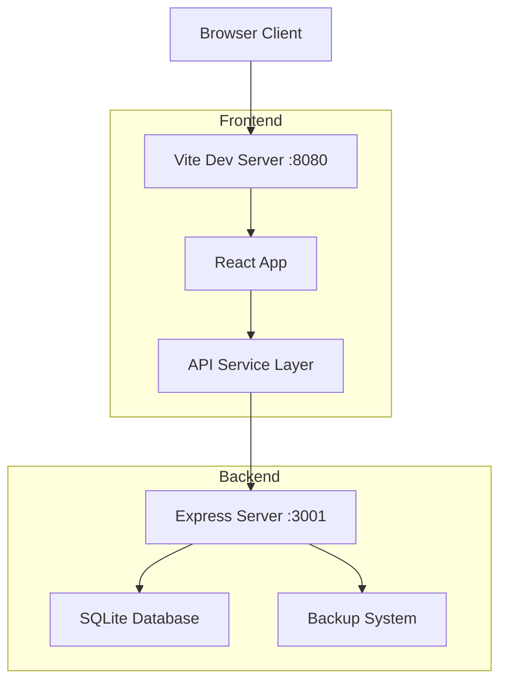

# 🚀 Guida per Sviluppatori e Manutentori Tecnici

## 📚 Indice
- [Panoramica Tecnica](#-panoramica-tecnica)
- [Setup Sviluppo](#-setup-sviluppo)
- [Architettura Sistema](#-architettura-sistema)
- [Personalizzazione per Negozi](#-personalizzazione-per-negozi)
- [API Reference](#-api-reference)
- [Database Schema](#-database-schema)
- [Manutenzione Tecnica](#-manutenzione-tecnica)
- [Debugging](#-debugging)
- [Estensioni e Modifiche](#-estensioni-e-modifiche)

---

## 🎯 Panoramica Tecnica

Rabbi E-Bike è un **sistema gestionale locale** per negozi di noleggio biciclette, progettato per:

### **🏪 Caso d'Uso Principale: Negozi Locali**
- **Computer permanente** nel negozio (Windows/Mac/Linux)
- **Funzionamento offline** - internet solo per updates
- **Multi-dispositivo** - PC + tablet + smartphone staff
- **Zero cloud dependencies** - tutto locale per privacy/controllo
- **Backup locali** - su chiavette USB o dischi esterni

### **🔧 Stack Tecnologico Scelto per Negozi:**
- **Frontend:** React + TypeScript (interfaccia moderna, responsive)
- **Backend:** Node.js + Express (facile da mantenere, cross-platform)
- **Database:** SQLite (file-based, no server, backup semplici)
- **Build:** Vite (fast reload per development)
- **Process Manager:** PM2 (restart automatici, logging)

## ⚡ Quick Start Development

```bash
# Clone repository
git clone https://github.com/simo-hue/rabbi-ebike-management-system.git rabbieebike
cd rabbieebike

# Install dependencies
npm install
cd server && npm install && cd ..

# Development mode (2 terminali)
# Terminal 1: Backend con auto-reload
cd server && npm run dev

# Terminal 2: Frontend con hot-reload
npm run dev

# Browser: http://localhost:8080
# API: http://localhost:3001/api/health
```

---

## 🛠️ Prerequisiti

### **Obbligatori:**
- **Node.js** >= 16.0.0 ([Download](https://nodejs.org/))
- **npm** >= 7.0.0 (incluso con Node.js)
- **Git** ([Download](https://git-scm.com/))

### **Raccomandati:**
- **VS Code** con estensioni:
  - TypeScript and JavaScript Language Features
  - ESLint
  - Prettier
  - Tailwind CSS IntelliSense
  - SQLite Viewer
- **Postman** o **Insomnia** per testare API
- **SQLite Browser** per ispezionare database

### **Verifica Prerequisiti:**
```bash
node --version    # >= v16.0.0
npm --version     # >= 7.0.0
git --version     # >= 2.0.0
```

---

## 🔧 Installazione Dettagliata

### **1. Clone e Setup Iniziale**

```bash
# Clone repository
git clone https://github.com/simo-hue/rabbi-ebike-management-system.git rabbieebike
cd rabbieebike

# Verifica struttura progetto
ls -la
# Dovresti vedere: package.json, src/, server/, README.md, etc.
```

### **2. Installazione Dipendenze Frontend**

```bash
# Install frontend dependencies
npm install

# Verifica installazione
ls node_modules/  # Dovresti vedere react, vite, typescript, etc.
```

**Dipendenze principali:**
- **React 18** + **TypeScript**
- **Vite** (build tool & dev server)
- **shadcn/ui** + **Radix UI** (componenti)
- **Tailwind CSS** (styling)
- **React Router** (routing)
- **React Query** (state management)
- **React Hook Form** (form handling)

### **3. Installazione Dipendenze Backend**

```bash
cd server
npm install

# Verifica installazione
ls node_modules/  # Dovresti vedere express, sqlite3, cors, etc.
```

**Dipendenze principali:**
- **Express.js** (server framework)
- **SQLite3** (database)
- **CORS** (cross-origin requests)
- **Body-parser** (request parsing)
- **Nodemon** (development auto-reload)

### **4. Configurazione Ambiente**

```bash
# Crea file di configurazione (opzionale)
cp server/.env.example server/.env  # Se presente

# Configurazione default:
# PORT=3001
# NODE_ENV=development
# DB_PATH=./rabbi_ebike.db
```

---

## 🚀 Avvio Ambiente di Sviluppo

### **Metodo 1: Terminali Separati (Raccomandato)**

```bash
# Terminal 1: Backend Development Server
cd server
npm run dev    # Usa nodemon per hot-reload
# Server running on http://localhost:3001

# Terminal 2: Frontend Development Server  
cd ..  # Torna alla root
npm run dev
# Local: http://localhost:8080
```

### **Metodo 2: Concurrently (Singolo Terminale)**

```bash
# Installa concurrently globally
npm install -g concurrently

# Aggiungi script a package.json root:
{
  "scripts": {
    "dev:full": "concurrently \"cd server && npm run dev\" \"npm run dev\""
  }
}

# Avvia entrambi i server
npm run dev:full
```

### **Metodo 3: Docker Compose (Avanzato)**

```yaml
# docker-compose.yml
version: '3.8'
services:
  frontend:
    build:
      context: .
      dockerfile: Dockerfile.frontend
    ports:
      - "8080:8080"
    depends_on:
      - backend
    
  backend:
    build:
      context: ./server
      dockerfile: Dockerfile
    ports:
      - "3001:3001"
    volumes:
      - ./server/rabbi_ebike.db:/app/rabbi_ebike.db
```

```bash
docker-compose up --build
```

---

## 🏗️ Architettura del Progetto

### **Struttura Directory:**

```
rabbieebike/
├── src/                          # Frontend React
│   ├── components/              # Componenti React
│   │   ├── ui/                 # componenti shadcn/ui base  
│   │   ├── BookingForm.tsx     # Form prenotazioni
│   │   ├── Calendar.tsx        # Calendario prenotazioni
│   │   └── ...
│   ├── pages/                  # Pagine/Route principali
│   ├── services/               # API client & business logic
│   │   └── api.ts             # Axios client configurato
│   ├── types/                  # TypeScript type definitions
│   │   └── bike.ts            # Tipi per entità principali
│   ├── hooks/                  # Custom React hooks
│   ├── utils/                  # Utility functions
│   └── main.tsx               # Entry point React
├── server/                      # Backend Node.js
│   ├── server.js              # Express server principale
│   ├── routes/                # API routes (se organizzate)
│   ├── database/              # Database utilities
│   ├── rabbi_ebike.db         # SQLite database (auto-created)
│   ├── backups/               # Database backups
│   └── package.json           # Server dependencies
├── public/                      # Assets statici
├── docs/                        # Documentazione
├── package.json                 # Frontend dependencies & scripts
├── vite.config.ts              # Configurazione Vite
├── tailwind.config.js          # Configurazione Tailwind
└── tsconfig.json               # Configurazione TypeScript
```

### **Architettura Sistema:**



### **Stack Tecnologico:**

#### **Frontend (Client-Side)**
- **Framework:** React 18 + TypeScript
- **Build Tool:** Vite (webpack alternative)
- **Styling:** Tailwind CSS + shadcn/ui
- **State Management:** 
  - React Query (server state)
  - React Hook Form (form state)
  - Context/Props (component state)
- **Routing:** React Router DOM
- **HTTP Client:** Axios (configurato in `services/api.ts`)

#### **Backend (Server-Side)**
- **Runtime:** Node.js
- **Framework:** Express.js
- **Database:** SQLite3 (file-based, no server required)
- **API Architecture:** RESTful
- **Authentication:** None (local use)
- **File Upload:** None (currently)

---

## 🔌 API Reference

### **Base URL**
```
http://localhost:3001/api
```

### **Endpoints Principali**

#### **🏪 Settings**
```bash
GET    /api/settings           # Get shop settings
PUT    /api/settings           # Update shop settings
```

#### **🚲 Bikes Management**
```bash
GET    /api/bikes              # List all bikes
POST   /api/bikes              # Add new bike
PUT    /api/bikes/:id          # Update bike
DELETE /api/bikes/:id          # Delete bike
GET    /api/bikes/available    # Get available bikes for date range
```

#### **📅 Bookings Management**
```bash
GET    /api/bookings           # List all bookings
POST   /api/bookings           # Create booking
PUT    /api/bookings/:id       # Update booking
DELETE /api/bookings/:id       # Delete booking
GET    /api/bookings/date/:date # Get bookings for specific date
```

#### **📊 Analytics**
```bash
GET    /api/analytics/bike-performance    # Bike usage analytics
GET    /api/analytics/revenue-breakdown   # Revenue analytics
GET    /api/analytics/dashboard          # Dashboard statistics
```

#### **💶 Fixed Costs**
```bash
GET    /api/fixed-costs        # List all fixed costs
POST   /api/fixed-costs        # Add new fixed cost
PUT    /api/fixed-costs/:id    # Update fixed cost
DELETE /api/fixed-costs/:id    # Delete fixed cost
```

#### **🔧 System Management**
```bash
GET    /api/health             # Server health check
GET    /api/backup             # Create database backup
POST   /api/restore            # Restore from backup
GET    /api/server-config      # Get server configuration
PUT    /api/server-config      # Update server configuration
```

### **Esempio Requests**

#### **Creare una prenotazione:**
```javascript
// POST /api/bookings
{
  "customerName": "Mario Rossi",
  "customerPhone": "+39 123 456 7890",
  "customerEmail": "mario@email.com",
  "startDate": "2024-06-15",
  "startTime": "09:00",
  "endDate": "2024-06-15", 
  "endTime": "18:00",
  "category": "giornata-intera",
  "totalPrice": 70.00,
  "guideService": false,
  "guidePrice": 0,
  "notes": "Cliente abituale",
  "bikes": [
    {"bikeId": 1, "quantity": 1},
    {"bikeId": 3, "quantity": 2}
  ]
}
```

#### **Aggiungere bicicletta:**
```javascript
// POST /api/bikes
{
  "type": "adulto",
  "size": "M", 
  "suspension": "solo-anteriore",
  "hasTrailerHitch": true,
  "quantity": 3
}
```

---

## 🗄️ Database Schema

### **Tabelle Principali**

#### **settings**
```sql
CREATE TABLE settings (
    id INTEGER PRIMARY KEY,
    shopName TEXT NOT NULL,
    phone TEXT,
    email TEXT, 
    openingHours TEXT,
    closingHours TEXT,
    hourlyRate REAL,
    halfDayRate REAL,
    fullDayRate REAL,
    guideRate REAL,
    createdAt DATETIME DEFAULT CURRENT_TIMESTAMP,
    updatedAt DATETIME DEFAULT CURRENT_TIMESTAMP
);
```

#### **bikes**
```sql
CREATE TABLE bikes (
    id INTEGER PRIMARY KEY,
    type TEXT NOT NULL,  -- 'adulto','bambino','carrello-porta-bimbi','trailer'
    size TEXT NOT NULL,  -- 'S','M','L','XL'  
    suspension TEXT NOT NULL,  -- 'solo-anteriore','full-suspension'
    hasTrailerHitch BOOLEAN DEFAULT 0,
    quantity INTEGER DEFAULT 1,
    createdAt DATETIME DEFAULT CURRENT_TIMESTAMP
);
```

#### **bookings**
```sql
CREATE TABLE bookings (
    id INTEGER PRIMARY KEY,
    customerName TEXT NOT NULL,
    customerPhone TEXT,
    customerEmail TEXT,
    startDate DATE NOT NULL,
    startTime TIME NOT NULL,
    endDate DATE NOT NULL,
    endTime TIME NOT NULL,
    category TEXT NOT NULL,  -- 'oraria','mezza-giornata','giornata-intera'
    totalPrice REAL NOT NULL,
    guideService BOOLEAN DEFAULT 0,
    guidePrice REAL DEFAULT 0,
    notes TEXT,
    status TEXT DEFAULT 'confermata',  -- 'confermata','in-corso','completata','cancellata'
    createdAt DATETIME DEFAULT CURRENT_TIMESTAMP,
    updatedAt DATETIME DEFAULT CURRENT_TIMESTAMP
);
```

#### **booking_bikes** (Many-to-Many)
```sql
CREATE TABLE booking_bikes (
    id INTEGER PRIMARY KEY,
    bookingId INTEGER,
    bikeId INTEGER,
    quantity INTEGER DEFAULT 1,
    FOREIGN KEY (bookingId) REFERENCES bookings(id) ON DELETE CASCADE,
    FOREIGN KEY (bikeId) REFERENCES bikes(id) ON DELETE CASCADE
);
```

#### **fixed_costs** (Nuovo)
```sql
CREATE TABLE fixed_costs (
    id INTEGER PRIMARY KEY,
    name TEXT NOT NULL,
    description TEXT,
    category TEXT NOT NULL,
    amount REAL NOT NULL,
    frequency TEXT NOT NULL,  -- 'mensile','annuale','una-tantum'
    startDate DATE NOT NULL,
    isActive BOOLEAN DEFAULT 1,
    createdAt DATETIME DEFAULT CURRENT_TIMESTAMP,
    updatedAt DATETIME DEFAULT CURRENT_TIMESTAMP
);
```

### **Indici per Performance**
```sql
CREATE INDEX idx_bookings_date ON bookings(startDate, endDate);
CREATE INDEX idx_booking_bikes_booking ON booking_bikes(bookingId);
CREATE INDEX idx_booking_bikes_bike ON booking_bikes(bikeId);
CREATE INDEX idx_bikes_type ON bikes(type);
CREATE INDEX idx_fixed_costs_active ON fixed_costs(isActive);
```

---

## 🧪 Testing

### **Setup Testing Environment**

```bash
# Install testing dependencies
npm install --save-dev @testing-library/react @testing-library/jest-dom vitest jsdom

# Backend testing
cd server
npm install --save-dev jest supertest nodemon
```

### **Frontend Tests**

```javascript
// src/tests/components/BookingForm.test.tsx
import { render, screen } from '@testing-library/react'
import { BookingForm } from '../components/BookingForm'

test('renders booking form', () => {
  render(<BookingForm />)
  expect(screen.getByText('Nuova Prenotazione')).toBeInTheDocument()
})
```

### **API Tests**

```javascript
// server/tests/api.test.js
const request = require('supertest')
const app = require('../server')

test('GET /api/health should return OK', async () => {
  const response = await request(app).get('/api/health')
  expect(response.status).toBe(200)
  expect(response.body.status).toBe('OK')
})

test('POST /api/bookings should create booking', async () => {
  const booking = {
    customerName: 'Test User',
    startDate: '2024-12-25',
    // ... altri campi
  }
  
  const response = await request(app)
    .post('/api/bookings')
    .send(booking)
    
  expect(response.status).toBe(201)
  expect(response.body.id).toBeDefined()
})
```

### **Run Tests**

```bash
# Frontend tests
npm test

# Backend tests  
cd server && npm test

# Coverage report
npm run test:coverage
```

---

## 🐛 Debugging

### **Frontend Debugging**

#### **Browser DevTools**
```bash
# Avvia con source maps
npm run dev

# Nel browser: F12 → Sources
# Puoi mettere breakpoints direttamente nel codice TypeScript
```

#### **VS Code Debugging**
```json
// .vscode/launch.json
{
  "version": "0.2.0",
  "configurations": [
    {
      "name": "Launch Chrome",
      "type": "chrome",
      "request": "launch",
      "url": "http://localhost:8080",
      "webRoot": "${workspaceFolder}/src"
    }
  ]
}
```

### **Backend Debugging**

#### **Console Logging**
```javascript
// server/server.js
console.log('Debug:', { request: req.body, user: req.user })

// Oppure con debug module
const debug = require('debug')('rabbi:server')
debug('Request received:', req.method, req.url)
```

#### **VS Code Debugging**
```json
// .vscode/launch.json
{
  "version": "0.2.0", 
  "configurations": [
    {
      "name": "Debug Server",
      "type": "node",
      "request": "launch",
      "program": "${workspaceFolder}/server/server.js",
      "env": {
        "NODE_ENV": "development",
        "DEBUG": "rabbi:*"
      }
    }
  ]
}
```

### **Database Debugging**

```bash
# Ispeziona database direttamente
cd server
sqlite3 rabbi_ebike.db

# Query di debug utili
.tables
.schema bookings
SELECT COUNT(*) FROM bookings WHERE DATE(startDate) = DATE('now');
SELECT * FROM booking_bikes JOIN bookings ON booking_bikes.bookingId = bookings.id;

# Log SQL queries (in server.js)
const db = new sqlite3.Database('rabbi_ebike.db', (err) => {
  if (err) console.error(err)
  else console.log('Connected to SQLite database')
})

// Enable logging
db.on('trace', (sql) => {
  console.log('SQL:', sql)
})
```

### **Network Debugging**

```bash
# Monitor requests
# Nel browser: F12 → Network

# Test API endpoints
curl -X GET http://localhost:3001/api/health
curl -X GET http://localhost:3001/api/bookings

# Con body JSON
curl -X POST http://localhost:3001/api/bookings \
  -H "Content-Type: application/json" \
  -d '{"customerName":"Test","startDate":"2024-12-25"}'
```

---

## 🔧 Scripts Disponibili

### **Frontend (`package.json`)**
```json
{
  "scripts": {
    "dev": "vite --host",                    // Dev server con hot reload
    "build": "vite build",                   // Production build
    "build:dev": "vite build --mode development", // Dev build
    "preview": "vite preview",               // Preview prod build
    "lint": "eslint src --ext .ts,.tsx",     // Lint TypeScript files
    "lint:fix": "eslint src --ext .ts,.tsx --fix", // Fix lint issues
    "type-check": "tsc --noEmit"            // Type checking only
  }
}
```

### **Backend (`server/package.json`)**
```json
{
  "scripts": {
    "start": "node server.js",              // Production server
    "dev": "nodemon server.js",             // Dev server with auto-reload
    "test": "jest",                         // Run tests
    "backup": "node scripts/backup.js",     // Manual backup
    "migrate": "node scripts/migrate.js"    // Database migrations
  }
}
```

### **Comandi Utili per Sviluppo**

```bash
# Lint e type-check completo
npm run lint && npm run type-check

# Build e test production
npm run build && npm run preview

# Sviluppo full-stack
cd server && npm run dev &  # Background
npm run dev                 # Foreground

# Database operations
cd server
sqlite3 rabbi_ebike.db ".backup backup_dev.db"
sqlite3 rabbi_ebike.db ".read seed.sql"  # Se hai dati seed

# Cleanup completo
rm -rf node_modules package-lock.json
cd server && rm -rf node_modules package-lock.json
cd .. && npm install && cd server && npm install
```

---

## 🚀 Build per Produzione

### **Frontend Build**
```bash
# Build ottimizzato
npm run build

# Verifica build
npm run preview

# Output in dist/
ls dist/  # index.html, assets/, etc.
```

### **Backend Production**
```bash
cd server
npm install --production  # Solo production dependencies

# Configurazione produzione
export NODE_ENV=production
export PORT=3001
npm start
```

### **Deploy Complete**
```bash
# Build frontend
npm run build

# Setup production
cd server
npm install --production
pm2 start server.js --name "rabbi-ebike"

# Serve frontend (con nginx, apache, o serve)
npx serve -s dist -l 8080
```

---

## 🤝 Contribuire

### **Setup Ambiente Contribuzione**

```bash
# Fork il repository su GitHub
# Clone la tua fork
git clone https://github.com/TUO-USERNAME/rabbi-ebike-management-system.git
cd rabbi-ebike-management-system

# Add upstream remote
git remote add upstream https://github.com/simo-hue/rabbi-ebike-management-system.git

# Crea branch per feature
git checkout -b feature/nuova-funzionalita
```

### **Coding Standards**

#### **TypeScript/React**
- Use TypeScript strict mode
- Componenti funzionali + hooks
- Props interface sempre definite
- Gestione errori con try/catch
- Loading states per async operations

#### **CSS/Styling**  
- Tailwind CSS utilities
- shadcn/ui components quando possibile
- Responsive design (mobile-first)
- Dark mode ready (se implementato)

#### **Backend**
- RESTful API conventions
- Proper HTTP status codes
- Input validation
- Error handling middleware
- SQL injection prevention

### **Commit Messages**
```bash
# Format: type(scope): description
git commit -m "feat(booking): add bulk booking creation"
git commit -m "fix(api): handle empty bike inventory"
git commit -m "docs(readme): update installation steps"

# Types: feat, fix, docs, style, refactor, test, chore
```

### **Pull Request Process**

1. **Testa** localmente con dati reali
2. **Lint** e **type-check** passano
3. **Documenta** nuove API o componenti  
4. **Aggiorna** tests se necessario
5. **Descrizione** chiara del problema risolto

```bash
# Prima di PR
npm run lint
npm run type-check  
npm run build
cd server && npm test
```

---

## 📚 Risorse Utili

### **Documentazione Tecnologie**
- [React](https://react.dev/) - Framework frontend
- [TypeScript](https://www.typescriptlang.org/) - Type safety
- [Vite](https://vitejs.dev/) - Build tool
- [Tailwind CSS](https://tailwindcss.com/) - Styling
- [shadcn/ui](https://ui.shadcn.com/) - Component library
- [Express.js](https://expressjs.com/) - Backend framework
- [SQLite](https://sqlite.org/) - Database

### **Tool per Sviluppatori**
- [SQLite Browser](https://sqlitebrowser.org/) - DB GUI
- [Postman](https://www.postman.com/) - API testing
- [React DevTools](https://react.dev/learn/react-developer-tools) - Browser extension

### **VS Code Extensions Raccomandate**
```json
// .vscode/extensions.json
{
  "recommendations": [
    "bradlc.vscode-tailwindcss",
    "esbenp.prettier-vscode", 
    "dbaeumer.vscode-eslint",
    "ms-vscode.vscode-typescript-next",
    "alexcvzz.vscode-sqlite"
  ]
}
```

---

**Happy Coding! 🚀** 

Per domande tecniche specifiche, apri un issue su GitHub con tag `question` o `help-wanted`.

**Made with ❤️ by Simone Mattioli** | Rabbi E-Bike Management System v1.0.0